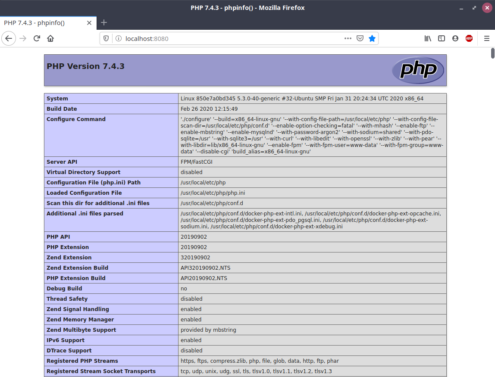

# docker-symfony-php-nginx-postgres

## Goal
When I first started to teach myself **docker** I couldn't easily find a repository using the somewhat rare combo stack: **PHP/Symfony**, **Nginx** and **Postgres**.

So my goal here is to help you set a development environment like that, using 4 containers:
- **postgres_server**
- **php_server**
- **nginx_server**
- **pgadmin_server**

## Step-by-step instructions
Steps to acomplish our goal:

1. Make sure you have `git`, `docker`, and `docker-compose` installed in your system. If you don't, please follow the instructions provided bellow:

- For **git**:

    [https://git-scm.com/downloads](https://git-scm.com/downloads)

- For **docker**:

    [https://docs.docker.com/get-docker/](https://docs.docker.com/get-docker/)

- For **docker-compose**:

    [https://docs.docker.com/compose/install/](https://docs.docker.com/compose/install/)

2. Clone this repository using `git clone` to directory `app-bundle` and set it as the current directory:

    ```
    /your/codebase/$ git clone https://github.com/rocharv/docker-symfony-php-nginx-postgres.git app-bundle
    /your/codebase/$ cd app-bundle
    /your/codebase/app-bundle$
    ```

3. In order to persist the **Postgres** database in your host machine, you must
create the `db` directory for it:

    ```
    /your/codebase/app-bundle$ mkdir db
    ```

5. In order to persist the configuration of **pgAdmin 4** web application
in your host machine, you must create the `pgadmin` directory for it:

    ```
    /your/codebase/app-bundle$ mkdir pgadmin
    ```

    Don't forget to change this directory ownership to the standard **user** and **group** of **pgAdmin**:

    ```
    /your/codebase/app-bundle$ sudo chown -R 5050:5050 pgadmin
    ```

5. Following Symfony's standards, the `index.php` should be in:

    `/your/codebase/app/public/index.php`

    > **Note:** I created an `index.php` file with `phpinfo()` in it so that you can
also check if all modules you need are there.

6. If you follow every previous step, your directory structure will look like this:

    ```
    /your/codebase/app-bundle$ tree
    .
    ├── app\
    │   └── public\
    │       └── index.php
    ├── db\
    ├── docker\
    │   ├── docker-compose.yml
    │   ├── nginx_service
    │   │   ├── Dockerfile
    │   │   └── nginx.env
    │   ├── pgadmin_service\
    │   │   ├── Dockerfile
    │   │   └── pgadmin.env
    │   ├── php_service\
    │   │   ├── composer-install.sh
    │   │   ├── Dockerfile
    │   │   ├── php.env
    │   │   ├── php.ini-development
    │   │   ├── php.ini-development-modified
    │   │   ├── php.ini-production
    │   │   └── xdebug.ini
    │   └── postgres_service\
    │       ├── Dockerfile
    │       └── postgres.env
    ├── nginx\
    │   ├── default.conf
    │   ├── project_access.log
    │   └── project_error.log
    ├── pgadmin\
    ├── pgadmin_server.pgn
    ├── php_server.pgn
    ├── README.md
    └── symfony-demo-app.png
    ```

    > **Note 1:**
    The `app` directory (where your **Symfony** source code shall live) is used by `docker-compose.yml`, php_service's `Dockerfile` and nginx's `default.conf`. If you want to use another name, you should go ahead and edit these files after step `2`.

    > **Note 2:**
    In the near future we will be creating a simpler way to change these setups through environment varibles and bash scripts.

7. Now it's time to run your containers. Use `docker-compose` to launch it from `docker` directory:

    ```
    /your/codebase/app-bundle$ cd docker
    /your/codebase/app-bundle/docker$ docker-compose up -d
    ```


8. Voilà ! You can test **PHP** and **Nginx** typing in your browser:

    [http://localhost:8080](http://localhost:8080)

    The result should look like this:

    
9. You can run **pgAdmin 4** by using the following URL:

    [http://localhost:16543](http://localhost:16543)

    The result should be:

    

    > **Note:** You can try **pgAdmin 4** from this screen using: \
    user: `user@domain.com` \
    password: `1234`

## Symfony's Demo App

You can create a new **Symfony** App inside the `app` directory. Don't forget that it must be empty (if you follow every step from the beginning, you will have to delete its content which is the `public` directory that contains the `index.php` file). We will also need to set **git** user's name and email.

If you don't have `composer` nor `symfony` installed in your host machine, you can execute `/bin/bash` from `php_server` container. In order to show you that, see how easy is to install **Symfony's Demo App**:

```
/your/codebase/app-bundle/docker$ docker exec -it php_server /bin/bash
root@850e7a0bd345:/var/www/app# rm -R public
root@850e7a0bd345:/var/www/app# git config --global user.name "User Name"
root@850e7a0bd345:/var/www/app# git config --global user.email "user@domain.com"
root@850e7a0bd345:/var/www/app# symfony new . --demo
root@850e7a0bd345:/var/www/app# chmod -R 777 var/log/
```

> **Note 1:** Your hostname that represents `php_server` will be probably a different hash from mine (850e7a0bd345), don't worry about that.

> **Note 2:** You can leave the container by typying `exit` on its terminal.

Browsing again [http://localhost:8080](http://localhost:8080) should result in:


## Shutting down

Tired of programming? Go grab a **Brazilian coffee** for yourself, it's good for you! But before doing that, shut down your **docker** containers:

```
/your/codebase/app-bundle/docker$ docker-compose down
```
    
## Last thoughts
I strongly recommend that you read/edit the `docker-compose.yml`, all `Dockerfiles` and `.env` files. Modifying them, customizing directories and settings is the only way forward.
